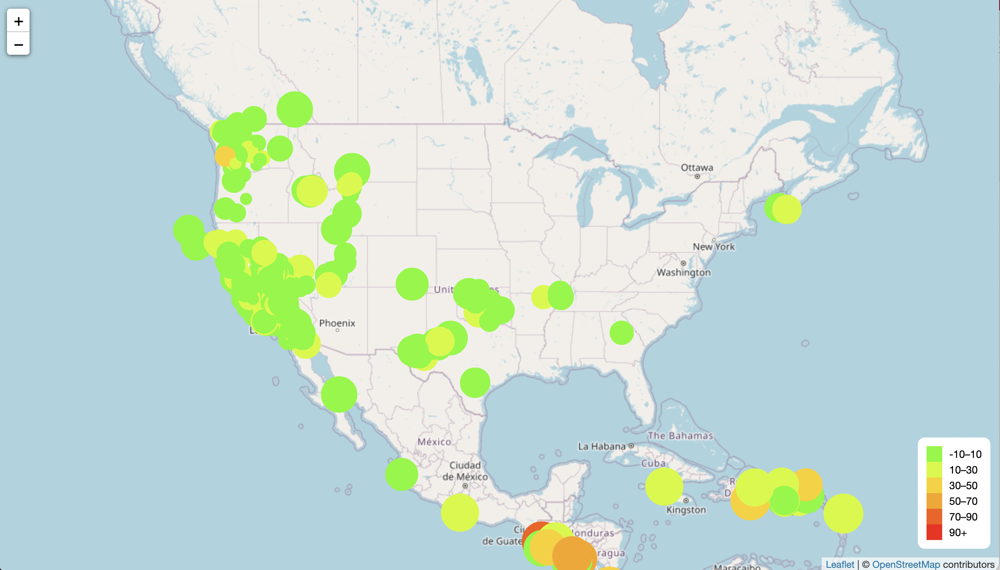
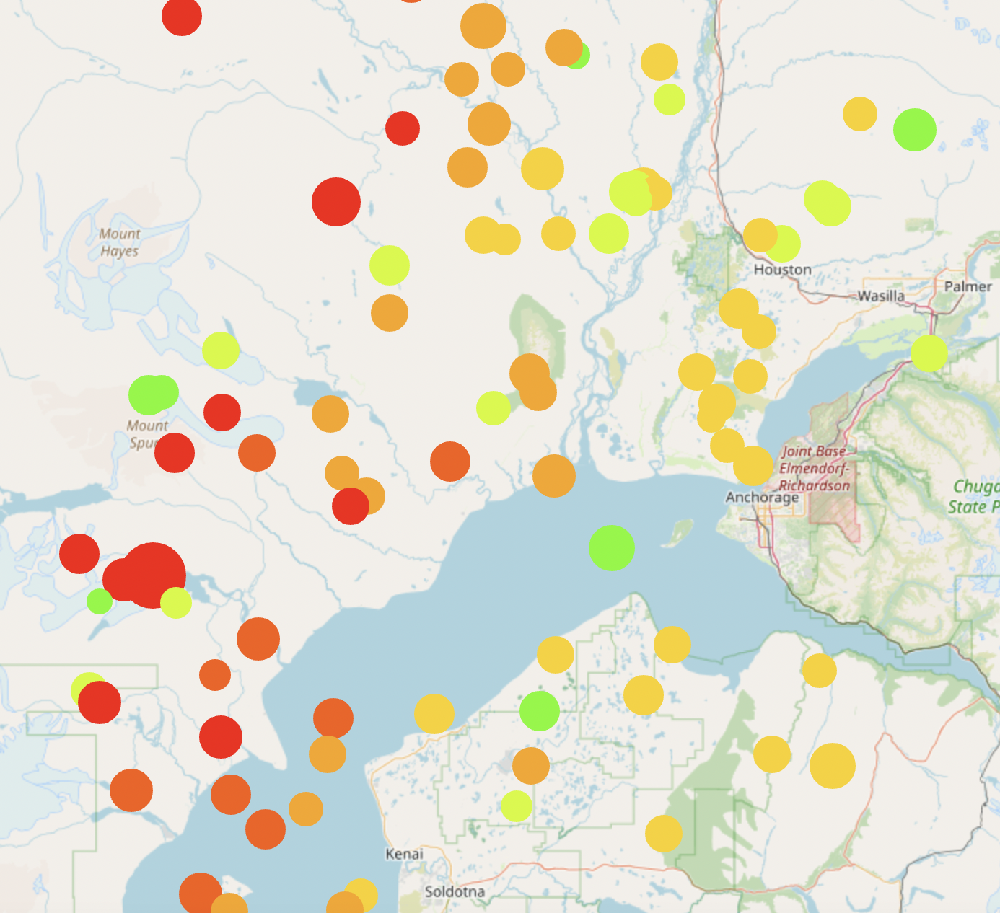
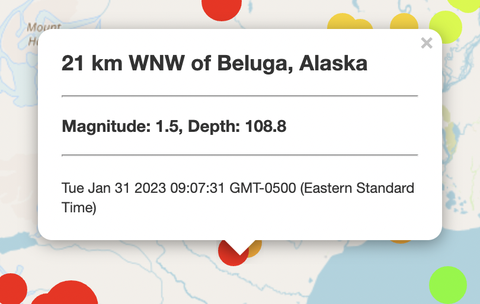
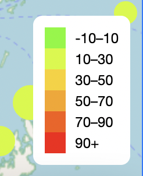

## United States Geological Survey Earthquake Data

Visualize Web Data of Earthquakes using Leaflet

### Dataset:

 [USGS Earthquake Data](https://earthquake.usgs.gov/earthquakes/feed/v1.0/geojson.php).

## Objectives

### Step 1 - D3 Import 

* Use the D3 library to read in all_week.geojson from the URL

### Step 2 - Leaflet Visualization

* Utilize Leaflet to visualize an USGS earthquake dataset
    * Create a map that plots all the earthquakes from the dataset based on their longitude and latitude

*  Data markers reflect the magnitude of the earthquake by their size and the depth of the earthquake by color
    * Earthquakes with higher magnitudes appear larger, and earthquakes with greater depth appear darker in color
            

       
* Popups provide additional information about the earthquake including the location, magnitude, depth and time when its associated marker is clicked
        

        
* Legend provides context for the map data

---------------------------------------------------

<b>Contact:</b> bronwynmilne64@gmail.com
